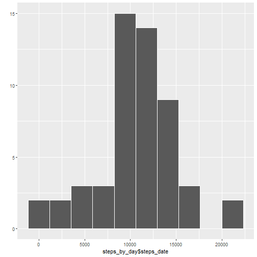

### Week 2: Course Project 1

**Cleaning workspace**

```r
rm(list=ls())
```

**Reading data and showing first 6 rows and number of total rows**

```r
activity_data <- read.csv("activity.csv")
head(activity_data)
```

```
##   steps       date interval
## 1    NA 2012-10-01        0
## 2    NA 2012-10-01        5
## 3    NA 2012-10-01       10
## 4    NA 2012-10-01       15
## 5    NA 2012-10-01       20
## 6    NA 2012-10-01       25
```

```r
nrow(activity_data)
```

```
## [1] 17568
```

**Eliminating NAs**

```r
activity_data_naomit <- na.omit(activity_data)
```

**Calculating steps per day**

```r
library(data.table)
setDT(activity_data_naomit)
head(steps_by_day <- activity_data_naomit[, .(steps_date = sum(steps)), by = date])
```

```
##          date steps_date
## 1: 2012-10-02        126
## 2: 2012-10-03      11352
## 3: 2012-10-04      12116
## 4: 2012-10-05      13294
## 5: 2012-10-06      15420
## 6: 2012-10-07      11015
```

**Steps histogram**

```r
library(ggplot2)
qplot(steps_by_day$steps_date, bins = 10, colour = I("white"))
```



**Mean and median (steps)**

```r
mean(steps_by_day$steps_date)
```

```
## [1] 10766.19
```

```r
median(steps_by_day$steps_date)
```

```
## [1] 10765
```

**Time series plot, interval vs mean(steps)**

```r
(mean_by_interval <- activity_data_naomit[, .(mean_steps=mean(steps)), by = interval])
```

```
##      interval mean_steps
##   1:        0  1.7169811
##   2:        5  0.3396226
##   3:       10  0.1320755
##   4:       15  0.1509434
##   5:       20  0.0754717
##  ---                    
## 284:     2335  4.6981132
## 285:     2340  3.3018868
## 286:     2345  0.6415094
## 287:     2350  0.2264151
## 288:     2355  1.0754717
```

```r
plot(mean_by_interval, type = "l", xaxt = "n")
axis(1, seq(0, 2355, length.out = 288), labels = mean_by_interval$interval,
     las = 2, cex.axis=.6)
```


**Maximum number of steps**

```r
library(dplyr)
arrange(mean_by_interval, desc(mean_steps))[1,]
```

```
##   interval mean_steps
## 1      835   206.1698
```

**Total of NAs by steps, date & interval**

```r
apply(activity_data, 2, function(M) sum(is.na(M)))
```

```
##    steps     date interval 
##     2304        0        0
```

**Filling NAs with the mean of the interval**

```r
setDT(activity_data)
mean_steps_nas <- merge(activity_data[is.na(steps),"interval"],
                        mean_by_interval, sort = F)$mean_steps
activity_data_full <- copy(activity_data)
activity_data_full[,steps := as.numeric(steps)]
activity_data_full[is.na(steps), steps := mean_steps_nas][]
```

```
##            steps       date interval
##     1: 1.7169811 2012-10-01        0
##     2: 0.3396226 2012-10-01        5
##     3: 0.1320755 2012-10-01       10
##     4: 0.1509434 2012-10-01       15
##     5: 0.0754717 2012-10-01       20
##    ---                              
## 17564: 4.6981132 2012-11-30     2335
## 17565: 3.3018868 2012-11-30     2340
## 17566: 0.6415094 2012-11-30     2345
## 17567: 0.2264151 2012-11-30     2350
## 17568: 1.0754717 2012-11-30     2355
```

**Total of NAs**

```r
apply(activity_data_full, 2, function(M) sum(is.na(M)))
```

```
##    steps     date interval 
##        0        0        0
```

**Plotting interval vs mean(steps) with imputed data**

```r
mean_by_interval_full <- activity_data_full[, .(mean_steps=mean(steps)),
                                            by = interval]
plot(mean_by_interval_full, type = "l", xaxt = "n")
axis(1, seq(0,2355,length.out = 288),labels = mean_by_interval_full$interval,
     las = 2, cex.axis=.6)
```


**Calculating steps per day**

```r
steps_by_day_full <- activity_data_full[, .(steps_date = sum(steps)), by = date]
```

**Histogram of the total numbers of steps**

```r
qplot(steps_by_day_full$steps_date, bins = 10, colour = I("white"))
```


**Calculating mean and median of the full data set**

```r
mean(steps_by_day_full$steps_date)
```

```
## [1] 10766.19
```

```r
median(steps_by_day_full$steps_date)
```

```
## [1] 10766.19
```

#### The imputed data dosen't impact the mean, nevertheless change the median and the hisogram because there are more values to show.

**Creating group_days factor variable (the names of the week days are in Spanish)**

```r
weekend_log <- weekdays(as.Date(activity_data_full$date)) %in%
      sort(weekdays(Sys.Date()+1:7))[c(1,6)]
group_days <- factor(levels = c("weekend", "weekday"))
group_days[weekend_log] <- "weekend"
group_days[!weekend_log] <- "weekday"
table(group_days)
```

```
## group_days
## weekend weekday 
##    4608   12960
```

```r
table(weekdays(as.Date(activity_data_full$date)))
```

```
## 
##   domingo    jueves     lunes    martes miércoles    sábado   viernes 
##      2304      2592      2592      2592      2592      2304      2592
```

```r
activity_data_full[, group_days := group_days][]
```

```
##            steps       date interval group_days
##     1: 1.7169811 2012-10-01        0    weekday
##     2: 0.3396226 2012-10-01        5    weekday
##     3: 0.1320755 2012-10-01       10    weekday
##     4: 0.1509434 2012-10-01       15    weekday
##     5: 0.0754717 2012-10-01       20    weekday
##    ---                                         
## 17564: 4.6981132 2012-11-30     2335    weekday
## 17565: 3.3018868 2012-11-30     2340    weekday
## 17566: 0.6415094 2012-11-30     2345    weekday
## 17567: 0.2264151 2012-11-30     2350    weekday
## 17568: 1.0754717 2012-11-30     2355    weekday
```

**Plotting by interval and group_days with lattice**

```r
mean_by_interval_full2 <- activity_data_full[, .(mean_steps=mean(steps)),
                                            by = .(interval, group_days)]
library(lattice)
xyplot(mean_steps ~ interval | group_days, data = mean_by_interval_full2,
       layout = c(1, 2), type = "l")
```


